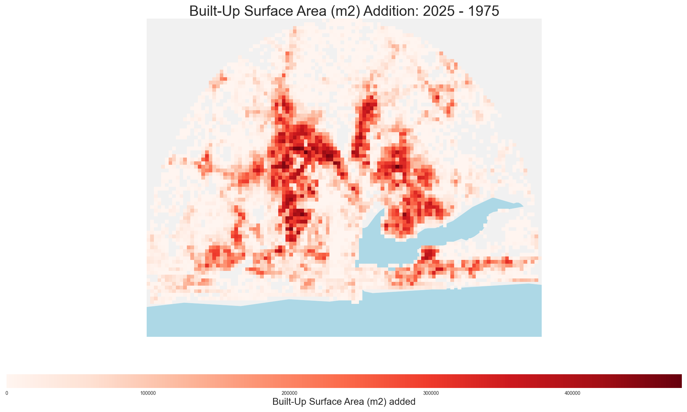

# ghslpy: Global Human Settlement Layer Python

`ghslpy` is a Python tool for downloading, analyzing, and visualizing data from the [Global Human Settlement Layer (GHSL)](https://ghsl.jrc.ec.europa.eu/). It provides a simple interface to fetch GHSL products for specific regions and time periods, and integrates with popular data analysis and plotting libraries like `xarray`, `pandas`, and `matplotlib`.

This README provides a basic guide to using `ghslpy`, based on the example analysis of urban growth in Lagos, Nigeria, available in [notebooks/lagos_example.ipynb](notebooks/lagos_example.ipynb).

## Features

-   Download GHSL data for population (`GHS-POP`) and built-up surface (`GHS-BUILT-S`).
-   Specify multiple epochs, resolution, and a region of interest.
-   Data is returned as an `xarray.Dataset` for easy manipulation.
-   Supports analysis of population and built-up area growth over time.
-   Includes functions for creating visualizations.

## Usage

The primary function is `ghslpy.download()`, which fetches the data you need.

### Example: Downloading Data for Lagos

Here's how to download population and built-up area data for a buffered region around Lagos for several epochs:

```python
import ghslpy
import geopandas as gpd
from shapely import wkt

# Define study area (Lagos, Nigeria)
buf = 60_000
p = "POINT(3.3642891130747983 6.482301819593587)"
point = gpd.GeoDataFrame([wkt.loads(p)], columns=["geometry"], crs=4326)
buffered = point.copy()
buffered["geometry"] = buffered.geometry.to_crs(3857).buffer(buf).to_crs(4326)

epochs = [1975, 1980, 1985, 1990, 1995, 2000, 2005, 2010, 2015, 2020, 2025]

# Download GHSL data
data = ghslpy.download(
    products=["GHS-POP", "GHS-BUILT-S"],
    epoch=epochs,
    resolution="1000m",
    region=buffered,
)

print(f"Data dimensions: {data.dims}")
print(f"Variables: {list(data.data_vars)}")
```

### Additional Features

Besides downloading data for a user-defined region, `ghslpy` provides utility functions to obtain boundaries from other sources.

#### Finding Regions with OpenStreetMap

The `ghslpy.utils.find_region` function allows you to get the boundary of a region using an OpenStreetMap query.

```python
import ghslpy.utils as utils

# Find the boundary of a single region
nigeria = utils.find_region("Nigeria")

# Find the boundaries of multiple regions
cities = utils.find_region(["Lagos", "Ibadan"])
```

#### Downloading GADM Boundaries

You can also download administrative boundaries from the [GADM dataset](https://gadm.org/) using `ghslpy.utils.download_gadm`.

```python
import ghslpy.utils as utils

# Download the country-level boundary for Nigeria (ADM level 0)
nigeria_gadm = utils.download_gadm("NGA", adm_level=0)

# Download the province-level boundaries for Nigeria (ADM level 1)
nigeria_provinces = utils.download_gadm("NGA", adm_level=1)
```

## Analysis and Visualization

The downloaded `xarray.Dataset` can be used for various analyses. The example notebook demonstrates how to calculate and visualize growth statistics.

### Growth Statistics

You can generate a DataFrame summarizing the growth in population and built-up area over time.

|    | Year      | Population_Total   | Population_Added   | Population_Growth_Rate_%   | BuiltUp_m2_Total   | BuiltUp_m2_Added   | BuiltUp_Growth_Rate_%   |
|---:|:----------|:-------------------|:-------------------|:---------------------------|:-------------------|:-------------------|:------------------------|
|  0 | 1975      | 3.5 M              | -                  | -                          | 301.1 M            | -                  | -                       |
|  1 | 1980      | 4.4 M              | 0.9 M              | 26.34                      | 318.3 M            | 17.2 M             | 5.73                    |
|  2 | 1985      | 5.6 M              | 1.1 M              | 25.85                      | 340.9 M            | 22.5 M             | 7.07                    |
|  3 | 1990      | 7.0 M              | 1.4 M              | 25.72                      | 367.1 M            | 26.3 M             | 7.71                    |
|  4 | 1995      | 8.2 M              | 1.2 M              | 17.27                      | 380.9 M            | 13.7 M             | 3.74                    |
|  5 | 2000      | 9.4 M              | 1.1 M              | 13.91                      | 399.1 M            | 18.3 M             | 4.8                     |
|  6 | 2005      | 10.7 M             | 1.3 M              | 14.16                      | 452.7 M            | 53.5 M             | 13.41                   |
|  7 | 2010      | 11.9 M             | 1.2 M              | 10.75                      | 536.1 M            | 83.5 M             | 18.44                   |
|  8 | 2015      | 13.0 M             | 1.2 M              | 9.73                       | 634.9 M            | 98.8 M             | 18.43                   |
|  9 | 2020      | 14.3 M             | 1.3 M              | 9.65                       | 688.0 M            | 53.1 M             | 8.37                    |
| 10 | 2025      | 15.7 M             | 1.4 M              | 9.81                       | 706.5 M            | 18.5 M             | 2.69                    |
| 11 | 1975–2025 | -                  | 12.2 M             | 346.02                     | -                  | 405.4 M            | 134.65                  |

### Dual-Axis Growth Rate Visualization

A dual-axis bar chart shows the growth rates of population and built-up area, making it easy to compare trends.


### Temporal Comparison Maps

You can create side-by-side maps to visualize the changes between two epochs.

**Population Comparison (1975 vs. 2025)**


**Built-up Area Comparison (1975 vs. 2025)**


### Spatial Difference Maps

Plotting the difference between two years highlights the areas with the most significant change.

**Built-up Area Addition (1975-2025)**


## License

This project is licensed under the MIT License - see the [LICENSE](LICENSE) file for details.